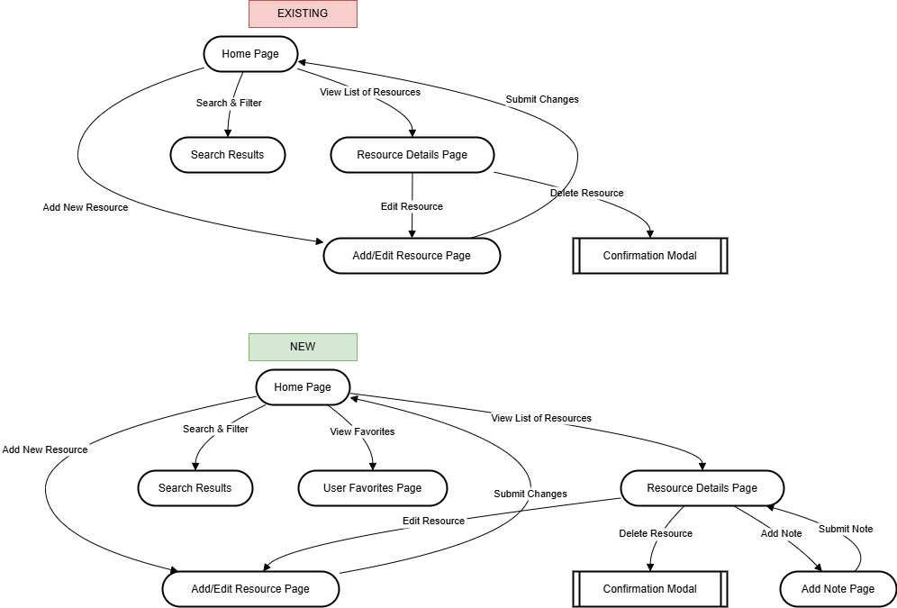
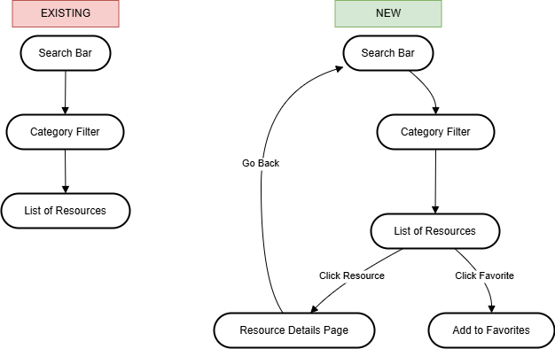
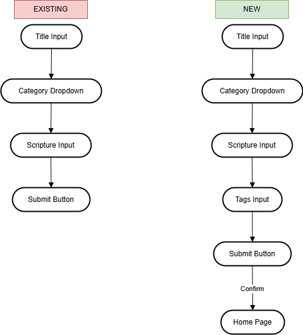
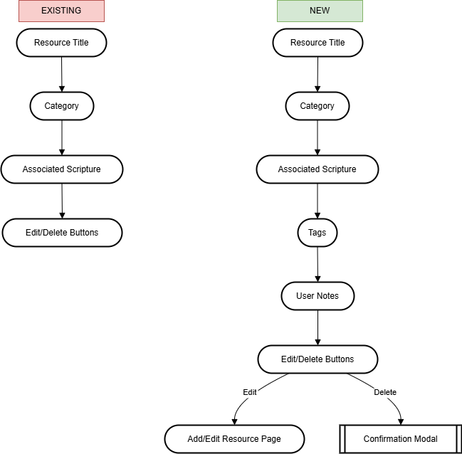
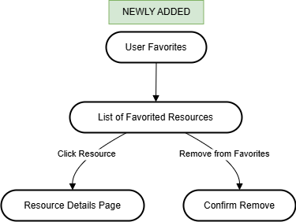
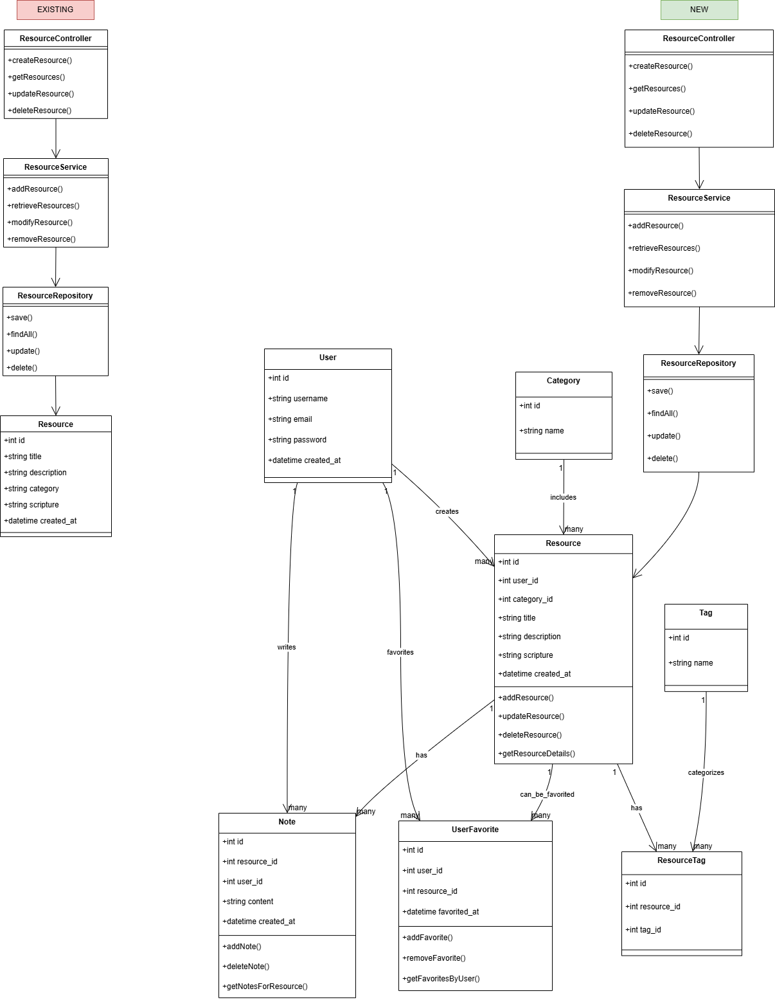

# CST-391: FaithTrack Milestone - Refined Project Proposal

**Author:** Matt Kollar  
**Class Number & Title:** CST-391: Database & Web Application Development  
**Date:** March 22, 2025

---

## Instructor Feedback

> *No formal instructor feedback was provided at the time of submission.*

## Response to Feedback

Since no feedback was given, no changes were made in direct response to instructor comments. However, continued refinement was completed independently to ensure quality and completeness of the design and implementation.

---

## **1. Introduction**  
FaithTrack is a web application designed to help users manage a collection of faith-based resources, such as Bible verses, devotionals, prayers, and Christian books. The application provides CRUD (Create, Read, Update, Delete) functionality along with additional features like search and categorization. This project is built with an Express.js backend using Node.js and written in TypeScript, supported by a MySQL relational database. Frontend development will be handled with both Angular and React for experimentation and comparison.

---

## **2. Design Updates**  
This section includes the design updates for the FaithTrack API project. The updated wireframes, ER diagram, and other designs are shown in the images below. These reflect changes made to the project during development.

**ER Diagram (Updated):**  
  
*Changes:* Corrected entity relationships, added `user_favorites` table, and enforced foreign key constraints.

**UI Sitemap (Updated):**  
  
*Changes:* Refined flow to include category filtering, detail views, and creation/editing screens.

**Homepage Wireframe (Updated):**  
  
*Changes:* Added search bar and category dropdown for filtering.

**Add/Edit Resource Wireframe (Updated):**  
  
*Changes:* Form supports full CRUD field inputs for title, description, scripture, and category selection.

**Resource Details Wireframe (Updated):**  
  
*Changes:* Displays expanded view of resource metadata.

**User Favorites (Newly Added):**  
  
*Changes:* Added support for users to mark and manage favorite resources, reflected in both schema and logic.

**UML Class Diagram (Updated):**  
  
*Changes:* Shows updated object relationships for controller-service-repository pattern.

---

## **3. Updates Summary**  
| Update Type                | Description                                                        | Status     |
|----------------------------|--------------------------------------------------------------------|------------|
| ER Diagram                 | Relationships corrected; added user_favorites                     | Completed  |
| UI Sitemap                 | New flows for filtering and CRUD actions                          | Completed  |
| Homepage Wireframe         | Includes category filter and search UI                            | Completed  |
| Add/Edit Resource Wireframe| Form fields improved for better UX and validation                 | Completed  |
| Resource Details Wireframe | More comprehensive view with full resource info                   | Completed  |
| User Favorites             | New feature supported in UI and backend design                    | Completed  |
| UML Diagram                | Reflects services and repositories for new logic                  | Completed  |

**Known Issues:** None at this time.

---

## **4. REST API Documentation**  

Your API follows REST conventions with plural nouns as resources and actions expressed via HTTP verbs:

| HTTP Method | Endpoint              | Description                      | Example Body (POST/PUT) |
|-------------|------------------------|----------------------------------|--------------------------|
| GET         | `/api/resources`       | Fetch all resources              | N/A                      |
| POST        | `/api/resources`       | Create new resource              | See below                |
| PUT         | `/api/resources/:id`   | Update an existing resource      | See below                |
| DELETE      | `/api/resources/:id`   | Delete resource by ID            | N/A                      |

### Request Body Example (POST)
```json
{
  "title": "New Faith-Based Resource",
  "description": "A detailed guide on spiritual growth",
  "category_id": 1,
  "scripture": "John 3:16"
}
```

### Request Body Example (PUT)
```json
{
  "title": "Updated Faith Resource",
  "description": "Updated description",
  "category_id": 1,
  "scripture": "Psalm 23:1"
}
```

---

## **5. Screencast Documentation**  
The screencast demonstrates:

1. Full CRUD operations using Postman (GET, POST, PUT, DELETE)
2. MySQL Workbench view of the results
3. Real-time interaction with the database through API calls

🎥 **Screencast Link**: [http://somup.com/cTeIDc7g00](http://somup.com/cTeIDc7g00)

---

## **6. Risks**  
- **Multi-Frontend Integration:** Potential conflicts or overhead when using Angular and React simultaneously.
- **Relational Schema Scaling:** As more features are added, constraints and foreign key dependencies may require adjustments.
- **Deployment Config:** Environment variables, server scripts, and database setup may differ across platforms.
