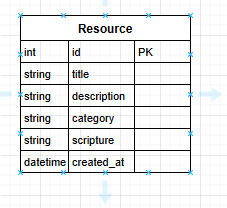
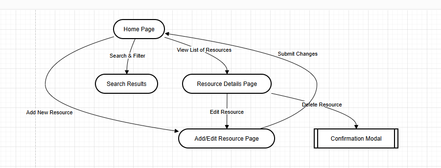
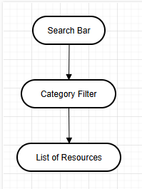
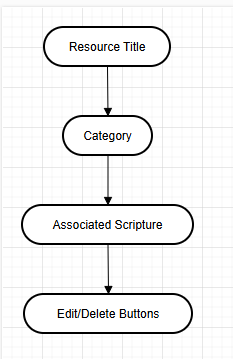
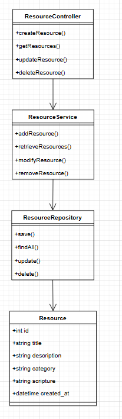

# CST-391: FaithTrack Milestone - Project Proposal

## Cover Sheet

**Class Number & Title:** CST-391: Database & Web Application Development  
**Application Name:** FaithTrack  
**Author:** Matt Kollar  

## **1. Introduction**
FaithTrack is a web application designed to help users manage a collection of faith-based resources, such as Bible verses, devotionals, prayers, and Christian books. The application will provide CRUD (Create, Read, Update, Delete) functionality along with additional features like search and categorization. This project will be implemented with an Express.js backend, a MySQL database, and two front-end frameworks: Angular and React.

## **2. Functionality Requirements**
- **As a user, I want to create a new faith-based resource** so that I can share it with others.
- **As a user, I want to view a list of all faith-based resources** so that I can browse what is available.
- **As a user, I want to search for specific resources by name or category** so that I can find relevant content quickly.
- **As a user, I want to update a resource’s details** so that I can keep the information accurate.
- **As a user, I want to delete a resource** so that I can remove outdated or irrelevant content.
- **As a user, I want to filter resources by category** so that I can explore specific types of faith-based content.

## **3. Initial Database Design**

**Description:** This section outlines the database structure, including tables and relationships necessary for managing faith-based resources.

**ER Diagram:**

## **4. Initial UI Sitemap**

**Description:** This section provides a high-level logical layout and flow of application pages and modules.

**UI Sitemap:**

## **5. Initial UI Wireframes**

**Description:** This section contains low-fidelity user interface designs for key application pages.

**Homepage Wireframe:**

**Add/Edit Resource Wireframe:**

**Resource Details Wireframe:**

## **6. Initial UML Classes**

**Description:** This section presents the backend services and object model class designs necessary for FaithTrack's operation.

**UML Class Diagram:**

## **7. Risks**

**Description:** This section outlines potential unknowns and risks that need to be tracked during project development.

- **Framework Complexity:** Managing two front-end frameworks (React & Angular) could introduce technical challenges.
- **Database Design Adjustments:** Possible need for schema modifications during development.
- **Deployment Issues:** Ensuring seamless integration between the frontend, backend, and database.
